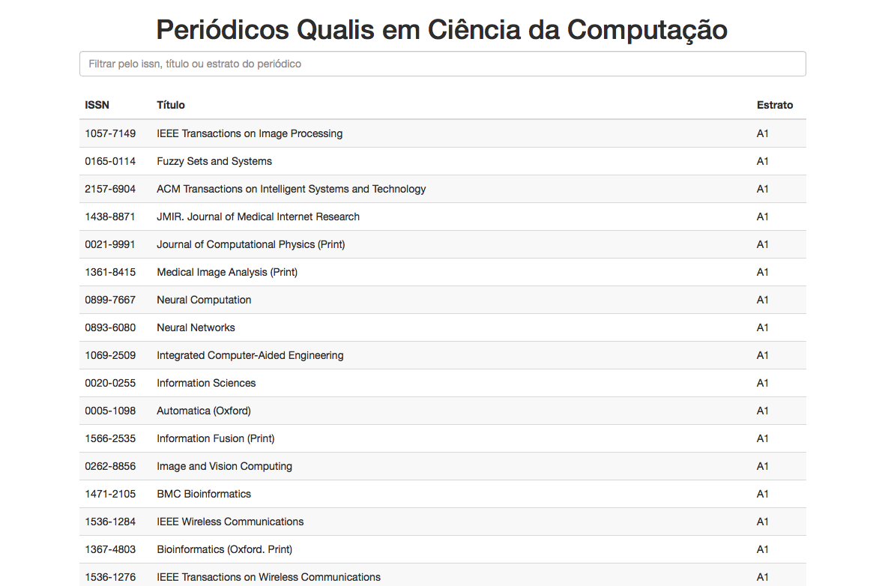

# qualis-cc-angular

Single Page Application usando Angular para listar a classificação dos periódicos em Ciência da Computação.

Este projeto é algo bem simples. Aproveitei que queria usar o [Angular.js](https://angularjs.org) para fazer alguma coisinha, apenas para brincar. Do outro lado, a minha necessidade de sempre procurar o qualis de algum periódico. Para quem é do meio acadêmico, sabe que é terrível, as vezes a informação não é atualizada, etc.

Portanto estruturei uma simples listagem ordenada por estrato (A1 - C), onde é possível fazer um filtro (como é a primeira versão ainda, o filtro utiliza todos os elementos de um periódico `{"_id":1,"titulo":"ACM Journal of Experimental Algorithmics","issn":"1084-6654","estrato":"B4"}`). Os dados foram obtidos acessando o [portal Sucupira](http://sucupira.capes.gov.br/) do governo, onde busquei o **Qualis 2014** da **Ciência da Computação**. Baixei o arquivo `xls`, e transformei em `json`.

A aplicação se encontra rodando [AQUI](https://qualiscc.herokuapp.com).

Quem quiser ajudar a melhorar o sistema é mais que bem-vindo! Erros, bugs e etc, também são bem-vindos!
